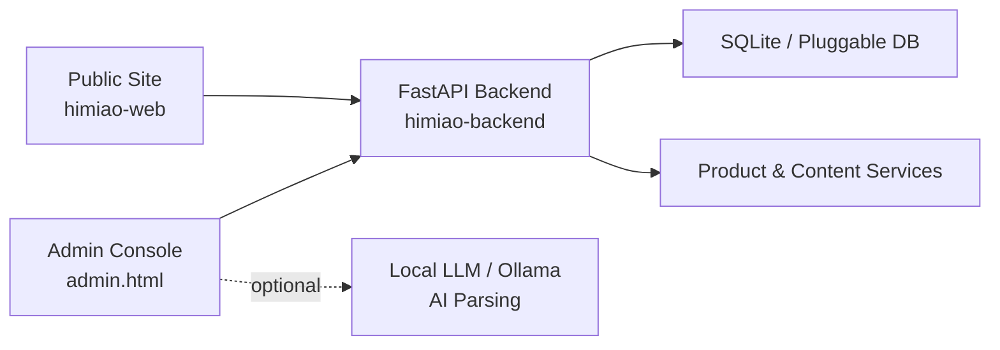

# HiMiao Hong Kong Insurance Audit Platform

[](LICENSE)


**HiMiao** is a sanitized, public-ready insurance product audit and presentation platform for Hong Kong insurance products.

It includes a public product website, an admin review workflow, and a FastAPI backend for authentication, product data, content, and optional local AI-assisted parsing.

**中文摘要：** HiMiao 是一个面向香港保险产品的信息审计与展示平台，包含公开前台、管理后台、API 后端和可选本地 AI 解析能力。本仓库是已清理敏感信息的公开版本，适合演示、二次开发和部署参考。


---

## Why This Exists

Insurance product information is often scattered across brochures, PDFs, sales materials, and internal notes. HiMiao explores a structured way to present, review, and manage Hong Kong insurance product information with a clear separation between public content and admin workflows.

> Disclaimer: This project is an information platform and admin system. It is **not** an offer to sell insurance, nor financial, investment, legal, tax, or actuarial advice.

---

## Features

| Area | What it does |
|---|---|
| Public site | Product list/detail pages, articles, multilingual navigation |
| Admin console | Login, product editing, draft/publish workflow, audit-oriented fields |
| API backend | FastAPI, JWT auth, product/content/user endpoints |
| Data model | SQLite by default, designed to be replaceable |
| AI assist | Optional local LLM/Ollama-style parsing flow via environment config |
| Public export | Secrets, production DBs, uploads, caches, and internal IPs removed |

---

## Architecture



---

## Repository Layout

```text
himiao-web/       Static frontend, public pages, admin UI, i18n scripts
himiao-backend/   FastAPI backend, models, routes, scripts, Docker config
docs/             Public-facing project docs and launch notes
LICENSE           MIT License
```

---

## Tech Stack

| Layer | Stack |
|---|---|
| Frontend | HTML, CSS, JavaScript |
| Backend | Python, FastAPI, SQLAlchemy |
| Database | SQLite by default |
| AI | Optional local model / Ollama-compatible endpoint |
| Deployment | Docker, docker-compose, Nginx/static hosting |

---

## Quick Start

1. Clone the repository.
2. Copy `himiao-backend/.env.example` to `himiao-backend/.env`.
3. Fill in JWT, database, email, and optional local AI model settings.
4. Start the backend from `himiao-backend/` using Docker Compose.
5. Serve `himiao-web/` with Nginx or any static server.
6. Open the public pages and admin UI, then verify API integration.

```bash
git clone https://github.com/miaoxin1979/himiao-hk-insurance-audit.git
cd himiao-hk-insurance-audit/himiao-backend
cp .env.example .env
docker compose up -d
```

> Note: No production database or user data is shipped. You must bootstrap or import your own data.

---

## Security Notes

This public bundle excludes or redacts:

- Real `.env` files, API keys, tokens, private keys
- Production databases, uploads, caches, and build artifacts
- Internal IPs and personal contact details
- Sensitive operational notes

Before using this in production:

- Re-scan for secrets and accidental PII
- Enable GitHub Secret Scanning and Dependabot
- Replace placeholder config with your own secure values
- Review legal, compliance, and licensing requirements for your jurisdiction

---

## 中文说明

HiMiao 是一个香港保险产品信息审计与展示平台，重点包括：

- 产品基础信息与结构化字段
- 公开前台产品展示和资讯内容
- 管理后台录入、审核、发布流程
- 中 / 英 / 繁多语言内容框架
- FastAPI 后端和 JWT 鉴权
- 可选本地模型辅助解析

本仓库是可公开发布版本，已移除或替换真实密钥、生产数据库、上传文件、缓存、大型构建产物、内网地址和个人联系信息。

本项目仅用于信息展示、系统演示和二次开发参考，不构成任何销售邀约、投保建议、投资建议、法律建议、税务建议或精算意见。

---

## Roadmap

- Cleaner seed-data workflow
- Better admin audit trail
- Product comparison improvements
- More explicit i18n content workflow
- Deployment guide with screenshots
- Demo dataset for public evaluation

---

## Contributing

Issues and pull requests are welcome, especially around:

- Insurance product data modeling
- Multilingual content workflow
- Admin review UX
- FastAPI backend hardening
- Public deployment documentation

---

## License

This project is licensed under the [MIT License](LICENSE).
