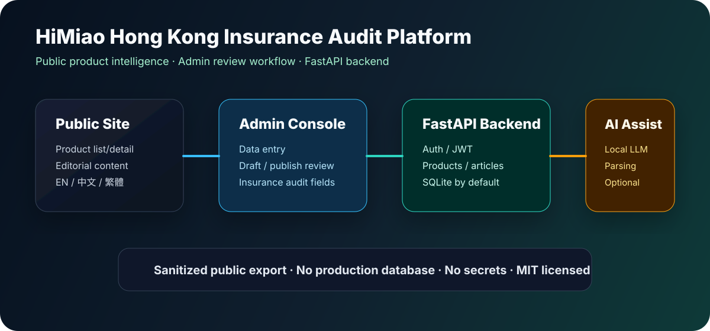

# HiMiao 香港保险审计平台

HiMiao 是一个面向**香港保险产品**的信息审计与展示平台，包含公开前台、管理后台、API 后端和可选本地 AI 解析能力。

> 本仓库为已清理敏感信息的公开版本，适用于演示、二次开发与部署参考。




## 功能概览

| 模块 | 说明 |
|---|---|
| 公开前台 | 产品列表、产品详情、资讯内容、多语言导航 |
| 管理后台 | 登录鉴权、产品编辑、草稿/发布流程、审计字段管理 |
| API 后端 | FastAPI、JWT、产品/内容/用户接口 |
| 数据库 | 默认 SQLite，可替换 |
| AI 辅助 | 可选本地模型/Ollama 兼容解析流程 |

## 技术栈

- 前端：HTML / CSS / JavaScript
- 后端：Python / FastAPI / SQLAlchemy
- 数据库：SQLite 默认
- 部署：Docker / docker-compose / 静态托管

## 仓库结构

```text
himiao-web/       静态前端、公开页面、后台页面、多语言脚本
himiao-backend/   FastAPI 后端、模型、接口、脚本、Docker 配置
docs/             项目文档和发布材料
LICENSE           MIT License
```

## 快速开始

```bash
git clone https://github.com/miaoxin1979/himiao-hk-insurance-audit.git
cd himiao-hk-insurance-audit/himiao-backend
cp .env.example .env
docker compose up -d
```

然后用 Nginx 或任意静态服务器托管 `himiao-web/`。

> 注意：仓库不包含生产数据库和用户数据，首次运行需要自行初始化或导入数据。

## 安全说明

公开包中已移除或替换：

- 真实 `.env`、密钥、token、私钥
- 生产数据库、上传文件、缓存与构建产物
- 内网地址和个人联系信息
- 敏感运维记录

生产使用前请重新扫描密钥、数据库文件、PII 和错误提交的内部配置。

## 免责声明

本项目为信息展示平台和管理系统，不构成任何销售邀约、投保建议、投资建议、法律建议、税务建议或精算意见。

## 许可证

MIT License
